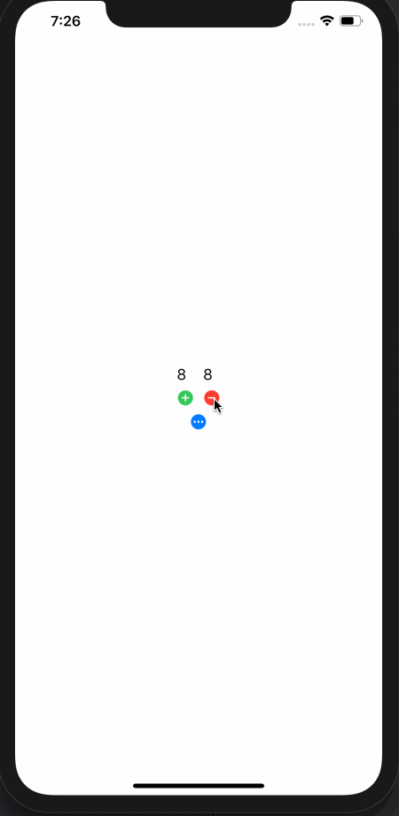

#  ClickCounter - iOS Udacity App

The lesson was geared towards building via storyboards, but I since building views programmatically is a skill I'm trying to learn, I replicated the UI via code. It uses stack views and sets constraints programmatically! 

## Getting Started

These instructions will get you a copy of the project up and running on your local machine for development and testing purposes.

### Prerequisites

#### Versions

* **Swift Version**: 5.0
* **XCode Version**: 11.1
* **iOS Version**: 13

### Installing

1. Open ClickCounter.xcodeproj
1. Choose a simulator that is supported for the versions listed above and run the app!

### Demo

## Authors

* **Udacity** - *Initial work* - [Udacity Nanodegree](https://www.udacity.com/course/ios-developer-nanodegree--nd003)
* **Jess Le** - *Completed Work* -[github](https://github.com/lovelejess)

## License

This project is licensed under the MIT License

