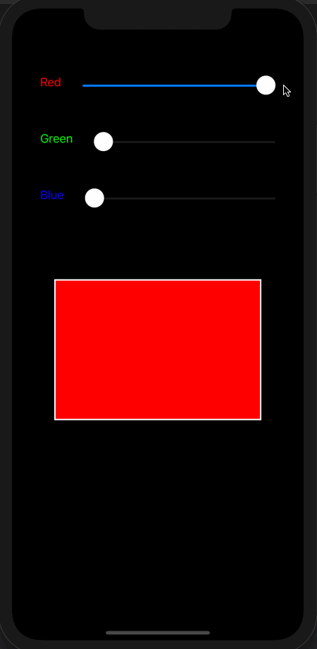

# Color Slider - iOS Udacity App

Reimplements the Color Maker app using UISlider controls instead of switches. With sliders you get a slightly more sophisticated palette; you can create millions of colors. Instead of using storyboards, this app creates all the views, layout constraints, such as stackviews, programmatically.

## Getting Started

These instructions will get you a copy of the project up and running on your local machine for development and testing purposes.

### Prerequisites

#### Versions

* **Swift Version**: 5.0
* **XCode Version**: 11.1
* **iOS Version**: 13

### Installing

1. Open ColorSlider.xcodeproj
1. Choose a simulator that is supported for the versions listed above and run the app!

### Demo

## Authors

* **Udacity** - *Initial work* - [Udacity Nanodegree](https://www.udacity.com/course/ios-developer-nanodegree--nd003)
* **Jess Le** - *Completed Work* -[github](https://github.com/lovelejess)

## License

This project is licensed under the MIT License

