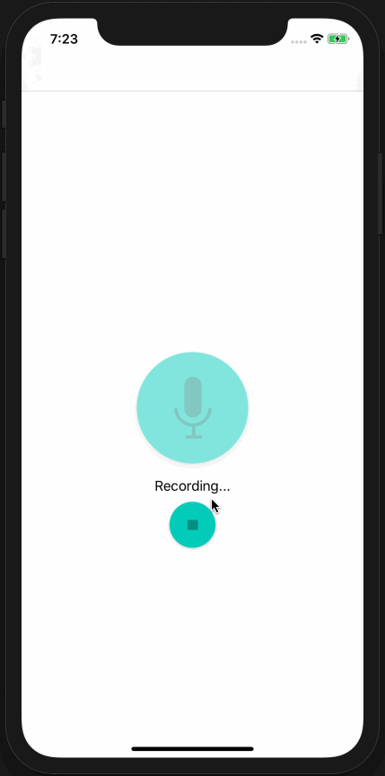

# Pitch Perfect - iOS Udacity App

Pitch Perfect is iPhone app that will allow users to record their voice and will then modulate the recorded audio to sound like a Chipmunk or Darth Vader. This app will also let the user speed up or slow down the rate of playback, and experience fun echo and reverb effects.

## Getting Started

These instructions will get you a copy of the project up and running on your local machine for development and testing purposes.

### Prerequisites

#### Versions

* **Swift Version**: 5.1
* **XCode Version**: 11.1
* **iOS Version**: 13

### Installing

1. Open PitchPerfect.xcodeproj
1. Choose a simulator that is supported for the versions listed above and run the app!

### Demo

## Authors

* **Udacity** - *Initial work* - [Udacity Nanodegree](https://www.udacity.com/course/ios-developer-nanodegree--nd003)
* **Jess Le** - *Completed Work* -[github](https://github.com/lovelejess)

## License

This project is licensed under the MIT License

