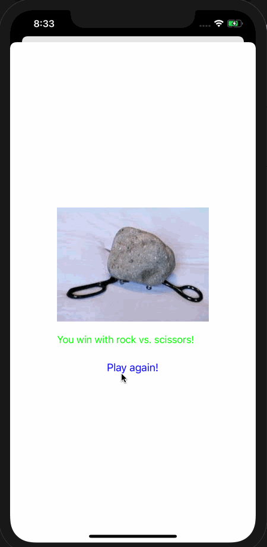

# Roshambo - iOS Udacity App

Rock, paper, scissors, shoot! This code showcases presenting view controllers and segues in two ways: programmatically and storyboards. There are two branches to this: `master`(programmatic implementation) and `storyboard`(programmatic implementation)

## Getting Started

These instructions will get you a copy of the project up and running on your local machine for development and testing purposes.

### Prerequisites

#### Versions

* **Swift Version**: 5.1
* **XCode Version**: 11.1
* **iOS Version**: 13

### Installing

1. Open Roshambo.xcodeproj
1. Choose a simulator that is supported for the versions listed above and run the app!

### Demo

## Authors

* **Udacity** - *Initial work* - [Udacity Nanodegree](https://www.udacity.com/course/ios-developer-nanodegree--nd003)
* **Jess Le** - *Completed Work* -[github](https://github.com/lovelejess)

## License

This project is licensed under the MIT License

